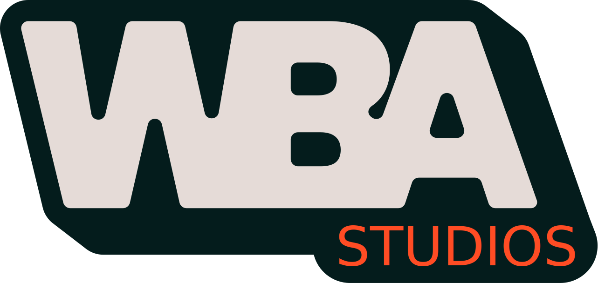

  

  <strong>WE BUILD ARTISTS &nbsp;✦&nbsp; WE BRING AUDIO &nbsp;✦&nbsp; WORK BUILD ACHIEVE &nbsp;✦&nbsp; WE MEAN BUSINESS</strong>

  <a href="https://wba.studio">🌐 wba.studio</a> &nbsp;|&nbsp;
  <a href="https://instagram.com/wba.lobby">📸 Instagram</a> &nbsp;|&nbsp;
  <a href="https://www.tiktok.com/@wbalobby">🎵 TikTok</a> &nbsp;|&nbsp;
  <a href="https://wa.me/+33609242891">💬 WhatsApp</a>

---

## About WBA

**WBA Studios** is a creative recording studio space designed for artists, musicians, and creators. We provide premium studio environments to help you bring your sound to life — from solo sessions to full productions.

Our spaces include a **Salon lounge**, **Studio A**, **Studio B**, and a **Terasse**, offering a versatile and inspiring atmosphere for any kind of creative session.

---

## Spaces

| Space | Description |
|-------|-------------|
| 🎙️ **Studio A** | Professional recording studio |
| 🎛️ **Studio B** | Versatile production room |
| 🛋️ **Salon** | Lounge area with TV wall |
| 🌿 **Terasse** | Outdoor creative space |

---

## This Organization

This GitHub organization hosts the source code and projects powering **WBA Studios**, including:

- 🌐 **[wba.studio](https://wba.studio)** — The official website of WBA Studios
- ⚙️ Internal tooling and automation
- 🎨 Design assets and front-end projects

---

## Contact

- 📧 [wbastudio.contact@gmail.com](mailto:wbastudio.contact@gmail.com)
- 📞 [+33 6 09 24 28 91](tel:+33609242891)
- 💬 [WhatsApp](https://wa.me/+33609242891)

---

  <strong>WITH BIG AMBITIONS &nbsp;✦&nbsp; WORK BUILD ACHIEVE &nbsp;✦&nbsp; WAGWAN BREDDA AH-DEH</strong>

